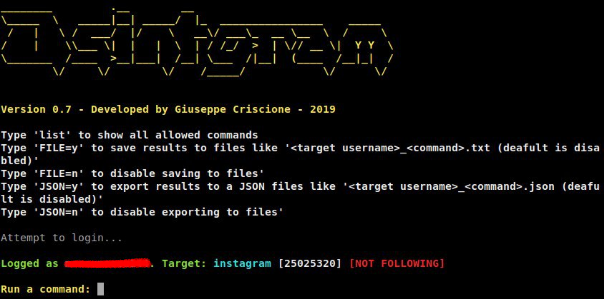

[](https://github.com/Datalux/Osintgram/releases/tag/0.9)
[](https://img.shields.io/badge/license-GPLv3-blue)
[](https://img.shields.io/badge/language-Python3-red)
[](https://t.me/osintgram)

# Osintgram
Osintgram is a **OSINT** tool on Instagram.

**I don't assume any responsability for the use of this tool**

Osintgram offers an interactive shell to perform analysis on Instagram account of any users by its nickname. You can get:
```
- addrs           Get all registered addressed by target photos
- captions        Get user's photos captions
- comments        Get total comments of target's posts
- followers       Get target followers
- followings      Get users followed by target
- fwersemail      Get email of target followers
- fwingsemail     Get email of users followed by target
- hashtags        Get hashtags used by target
- info            Get target info
- likes           Get total likes of target's posts
- mediatype       Get user's posts type (photo or video)
- photodes        Get description of target's photos
- photos          Download user's photos in output folder
- propic          Download user's profile picture
- stories         Download user's stories  
- tagged          Get list of users tagged by target
- wcommented      Get a list of user who commented target's photos
- wtagged         Get a list of user who tagged target
```
You can find detailed commands usage [here](doc/COMMANDS.md).

[**Latest version**](https://github.com/Datalux/Osintgram/releases/tag/0.9) | 
[CHANGELOG](doc/CHANGELOG.md)

## Tools
<p align="center">

</p>


# Installation
1. Fork/Clone/Download this repo

    `git clone https://github.com/Datalux/Osintgram.git`


2. Navigate to the directory

    `cd Osintgram`

3. Run `pip3 install -r requirements.txt`


4. Create a subdirectory `config`

    `mkdir config`

5. Create in `config` folder the file: `username.conf` and write your Instagram account username

6. Create in `config` folder the file: `pw.conf` and write your Instagram account password

7. Create in `config` folder the file: `settings.json` and write the following string: "{}" without quotation marks

8. Run the main.py script 

    `python3 main.py <target username>`

## Updating

Run `git pull` in Osintgram directory

# Contributing
You can propose a feature request opening an issue or a pull request.

Here is a list of Osintgram's contributors.

<a href="https://github.com/Datalux/Osintgram/graphs/contributors">
  
</a>

## External library
Instagram API: https://github.com/ping/instagram_private_api
