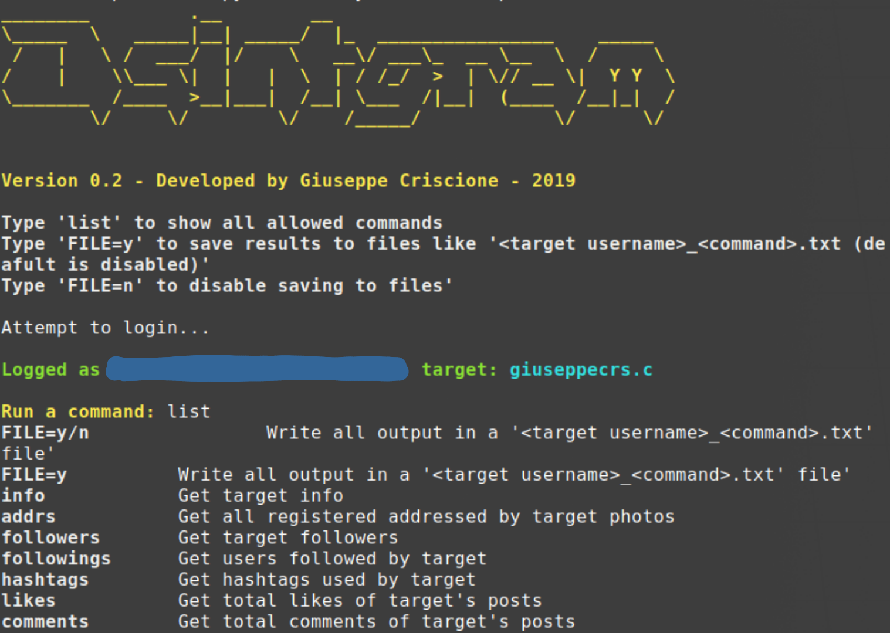

[](https://img.shields.io/badge/version-0.3-green)
[](https://img.shields.io/badge/license-GPLv3-blue)


# Osintgram
Osintgram is a **OSINT** tool on Instagram.
Osintgram is a fork of https://github.com/LevPasha/Instagram-API-python and https://github.com/woj-ciech/OSINT/tree/master/insta.

**I don't assume any responsability for the use of this tool**

Osintgram offers an interactive shell to perform analysis on Instagram account of any users by its nickname. You can get:
```
- info            Get target info
- addrs           Get all registered addressed by target photos
- followers       Get target followers
- followings      Get users followed by target
- hashtags        Get hashtags used by target
- likes           Get total likes of target's posts
- comments        Get total comments of target's posts
- tagged          Get list of users tagged by target
- photodes        Get description of target's photos
- photos          Download user's photos in output folder
- captions        Get user's photos captions
- mediatype       Get user's posts type (photo or video)
- propic          Download user's profile picture

```
You can find detailed commands usage [here](commands.md).


The tools use Python3.

## Changelog
- v0.1 initial release
- v0.2 added feature to write in file the output of commands
- v0.3 added features: photos, captions, mediatype, propic

## Tools


## Installation
1. Fork/Clone/Download this repo

    `git clone https://github.com/Datalux/Osintgram.git`


2. Navigate to the directory

    `cd Osintgram`

3. Run `pip3 install -r requirements.txt`


4. Create a subdirectory `config`

    `mkdir config`

5. Create in `config` folder the file: `username.conf` and write your Instagram account username

6. Create in `config` folder the file: `pw.conf` and write your Instagram account password

7. Run the main.py script 

    `python3 main.py <target username>`

## Updating

Run `git pull` in Osintgram directory
