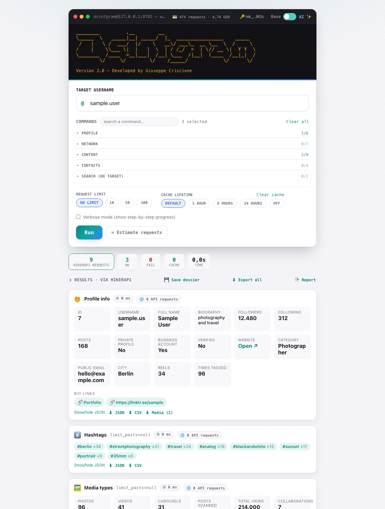
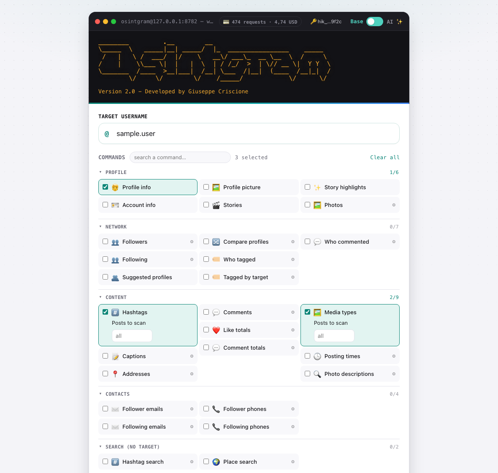

# Osintgram 🔎📸

[](doc/CHANGELOG.md)
[](LICENSE)
[](https://www.python.org/)
[](.github/workflows/tests.yml)
[](#quick-start)

**Point it at an Instagram account and find out who's behind it.** Osintgram
collects, cross-references and lays out everything a public profile gives away
— followers, captions, hashtags, geotagged locations, posting habits, public
contact details — in a web interface you run on your own machine.

Ask in plain language and a **local AI model** figures out which lookups to
run. Or don't: pick the commands yourself and skip the model entirely.

<p align="center">

</p>

---

## Why you might like it

**It answers questions, not just commands.** *"How many followers do they have and which
hashtags do they use most?"* runs three lookups and comes back with a written answer —
and the raw results underneath, so you can check the work instead of trusting
the prose.

**Nothing leaves your machine except the lookups themselves.** The AI runs
locally through [Ollama](https://ollama.com): no OpenAI key, no subscription, no
prompt of yours sent to anyone. The interface is served from `127.0.0.1`.

**It tells you what a search will cost before you run it.** Instagram data
isn't free, and most tools let you find out the expensive way. This one prices
your selection up front, shows your remaining credit, caches every request so
you never pay twice for the same lookup, and lets you cap or stop a run —
server-side, not just in the browser.

**It shows you what it found, properly.** Post thumbnails in a filterable grid,
geotagged locations on a map, a weekday × hour heatmap of when someone posts,
comparison between two accounts. Not a wall of JSON — though the JSON is one
click away on every card.

**You can hand the result to someone else.** One button turns a finished search
into a standalone HTML report that opens in any browser, with no server and no
Osintgram.

---

## Two ways to drive it

<p align="center">

</p>

**AI mode** — describe what you want. A local model picks the commands, runs
them and summarizes. It can only choose from the same list below; it can't
invent lookups or make up data.

**Base mode** — no model, no Ollama needed. All 28 commands, one line each,
grouped and searchable. Tick what you want, set the parameters, run them in
order.

You can also leave the username empty in AI mode and just ask about a hashtag
or a place — those searches belong to no account.

---

## What you can find out

| | |
|---|---|
| **Profile** | Bio and every link in it, follower/following/post counts, category, public email, phone and business address down to the coordinates, linked Facebook id — plus Instagram's own *About this account*: country of registration, creation date, how many times the username changed |
| **Network** | Followers and followings, accounts Instagram suggests as related, who tagged them, who they tagged, who comments most — and **mutual connections** between two accounts |
| **Content** | Hashtags ranked by use, captions, every comment, like and comment statistics, photo/video/carousel breakdown with views and paid partnerships, **posting-times heatmap**, geotagged locations **on a map**, photo alt text |
| **Contacts** | Public emails and phone numbers among a target's followers or followings |
| **No target needed** | Posts published with a **hashtag** (top or recent) or from a **place**, and who published them |

Stories, highlights and profile pictures come back as direct CDN links — and
any card with media in it offers a one-click zip of the originals.

---

## Quick start

```bash
pip install -r requirements.txt
uvicorn src.web.app:app --host 127.0.0.1 --port 8000 --reload   # or: make run
```

Open **<http://127.0.0.1:8000>**.

You need a data backend. The page opens on a panel where you can paste a
[HikerAPI](https://hikerapi.com) key directly — it's verified before it's
accepted, and can be saved for next time. (A free
[instagrapi](https://github.com/subzeroid/instagrapi) login works too, using an
Instagram account of your own — see the guide for the trade-offs.)

For AI mode, install [Ollama](https://ollama.com/download) and pull a
tool-calling capable model:

```bash
ollama pull llama3.1:8b     # ~4.7 GB, the default
```

Base mode works without it.

Prefer containers?

```bash
docker compose up      # or: make docker
```

Same address, same behaviour — published on `127.0.0.1` only. Your key, cache
and saved searches stay on the host in `config/`, `cache/` and `dossier/`,
never inside the image. AI mode reaches an Ollama running on your host.

> $${\color{red}Warning:}$$ This runs on `127.0.0.1` with **no authentication**. It's built to run on your own machine — don't expose it beyond localhost without putting an auth layer in front of it first.

### 📖 [Read the full guide → `doc/web-ui.md`](doc/web-ui.md)

Setup for both backends, every command with its parameters and cost, how to
keep spending down, exporting and sharing results, all configuration options,
and troubleshooting.

---

## Before you use it

**FOR EDUCATIONAL PURPOSE ONLY.** The contributors do not assume any
responsibility for the use of this tool.

- **Don't use your own or primary Instagram account** with it.
- **Never commit `config/credentials.ini`** — API keys and Instagram
  credentials live there. It's git-ignored; keep it that way. If a key has ever
  been pushed, rotate it: deleting the file doesn't remove it from history.
- Results contain other people's personal data. Handle them in line with
  data-protection law (GDPR and equivalents) and Instagram's Terms of Use.
- You cannot see private profiles. Nothing can. Tools claiming otherwise are
  scams.

---

## Development

```bash
pip install -r requirements-dev.txt
python -m pytest
```

The test suite runs entirely against synthetic fixtures — no API key, no quota,
no network. It also checks that the documentation hasn't drifted away from the
code.

Feature requests and pull requests are welcome — open an issue. Found a
security problem? Please report it privately instead: see [SECURITY.md](SECURITY.md).

---

## Credits

Osintgram is written by **Giuseppe Criscione**
([Datalux](https://github.com/Datalux)). Version 2.0 rebuilds it around a web
interface and a reusable service layer, and adds the AI mode, the cost controls
and the newer analyses — see the [changelog](doc/CHANGELOG.md).

It owes a great deal to everyone who has contributed since the first release:

<a href="https://github.com/Datalux/Osintgram/graphs/contributors">
  
</a>

Instagram data comes from [HikerAPI](https://hikerapi.com) or
[instagrapi](https://github.com/subzeroid/instagrapi). Geocoding by
[Nominatim](https://nominatim.org) / [OpenStreetMap](https://www.openstreetmap.org/copyright).
Maps by [Leaflet](https://leafletjs.com). Local models via
[Ollama](https://ollama.com).

Released under the [GPL-3.0](LICENSE) licence.

Instagram is a trademark of Meta Platforms, Inc. This project is not affiliated
with, endorsed by, or approved by Meta.
